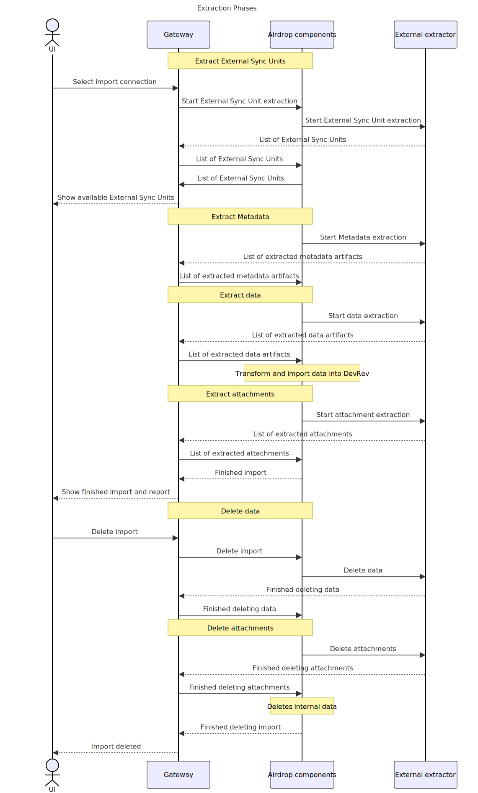

Airdrop extractions are done in _sync runs_. A sync run is one execution of an import or sync. If you do an inital import from
the external system to DevRev, that import will be one sync run. If you then decide to do a reverse sync from DevRev to
external system, that would be another sync run.

Each sync run is comprised out of phases. Phases follow sequentially, and each can consist of one or more invocations
of the snap-in.

## Sync modes

### Initial import

An _initial import_ is the first import of data from the external system to DevRev.
It is triggered manually by the end user in DevRev's Imports UI.

An _initial import_ consists of the following phases:
1. External sync units extraction
2. Metadata extraction
3. Data extraction
4. Attachments extraction

## 1-way sync

A _1-way sync_ refers to any extraction after the initial import has been successfully completed.
An extractor extracts data that was created and/or updated in the external system
after the start of the latest successful forward sync, including any changes that occurred during the
forward sync, but were not picked up by it.

A snap-in must consult its state to get information on when the last successful forward sync started. ADaaS snap-ins
must maintain its own state that persists between phases in a sync run, as well as between sync runs.

A 1-way sync consists of the following phases:
1. Metadata extraction
2. Data extraction
3. Attachments extraction

A 1-way sync extracts only the domain objects updated and/or created since the previous successful sync run.

## Deletion mode

A _deletion_ consists of the following phases:
1. Data deletion
2. Attachments deletion

