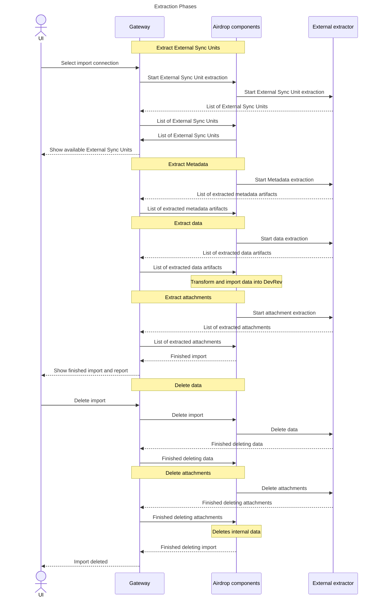

Airdrop extractions are done in sync runs, and each sync run is comprised out of phases.
Phases follow sequentially, and each can consist of one or more invocations of the worker.

## Sync modes

### Initial import

An initial import is the first import of data from the external system to DevRev.
It is triggered manually by the end user in DevRev's Imports UI.

An initial import consists of the following phases:
- external sync units extraction,
- metadata extraction,
- data extraction,
- attachments extraction.

## 1-way sync

An 1-way sync refers to any extraction after the initial import has been successfully completed.
An extractor extracts data that was created and/or updated in the external system
after the start of the latest successful forward sync, including any changes that occurred during the
forward sync, but were not picked up by it.

A snap-in must consult its state to get information on when the last successful forward sync started. ADaaS snap-ins
must maintain its own state that persists between phases in a sync run, as well as between sync runs.

An 1-way sync consists of the following phases:
- metadata extraction,
- data extraction,
- attachments extraction.

An 1-way sync extracts only the domain objects updated and/or created since the previous successful sync run.

## Deletion mode

A deletion sync consists of the following phases:
- data deletion,
- attachments deletion.

## Event types per extraction phases

### External sync unit extraction

### Metadata extraction

### Data extraction

Airdrop initiates data extraction by starting the Worker with a message with eventType `EXTRACTION_DATA_START`
when transitioning to the Data Extraction phase.

During the Data Extraction phase, the Worker extracts data from an External System,
prepares batches of data and uploads them in the form of Artifacts to DevRev.

The Worker must respond to Airdrop with a message with eventType `EXTRACTION_DATA_PROGRESS`,
together with an optional progress estimate and relevant Artifacts
when it extracts some data and the maximum Worker runtime (12 minutes) has been reached. 

The Worker must respond to Airdrop with a message with eventType `EXTRACTION_DATA_DELAY` and specifying back-off time
when the extraction has been rate-limited by the External System and back-off is required.

In both cases, Airdrop starts the Worker with a message with eventType `EXTRACTION_DATA_CONTINUE`.
The restarting is immediate (in case of `EXTRACTION_DATA_PROGRESS`) or delayed (in case of `EXTRACTION_DATA_DELAY`).

Once the Data Extraction is done, the Worker must respond to Airdrop with a message with eventType `EXTRACTION_DATA_DONE`.

If Data Extraction failed in any moment of extraction, the Worker must respond to Airdrop with a message with eventType `EXTRACTION_DATA_ERROR`.

### Attachments extraction

Airdrop initiates the Attachment Extraction by starting the Worker with a message with eventType `EXTRACTION_ATTACHMENTS_START`
when transitioning to the Data Extraction phase.

During the Attachment Extraction phase,
the Worker extracts attachments from the External System and uploads them as Artifacts to DevRev.

The Worker must respond to Airdrop with a message with eventType `EXTRACTION_ATTACHMENTS_PROGRESS` together with an optional progress estimate and relevant Artifacts
when it extracts some data and the maximum Worker runtime (12 minutes) has been reached.

The Worker must respond to Airdrop with a message with eventType `EXTRACTION_ATTACHMENTS_DELAY` and specify a back-off time
when the extraction has been rate-limited by the External System and back-off is required.

In both cases, Airdrop starts the Worker with a message with eventType `EXTRACTION_ATTACHMENTS_CONTINUE`.
The restart is immediate (in case of `EXTRACTION_ATTACHMENTS_PROGRESS`) or delayed
(in case of `EXTRACTION_ATTACHMENTS_DELAY`).

Once the Attachment Extraction phase is done, the Worker must respond to Airdrop with a message with eventType `EXTRACTION_ATTACHMENTS_DONE`.

If Attachment Extraction failed, the Worker must respond to Airdrop with a message with eventType `EXTRACTION_ATTACHMENTS_ERROR`.

### Data deletion

Airdrop initiates the Data Delete phase when the Sync is deleted from DevRev.
It is started by sending the Worker a message with eventType: `EXTRACTION_DATA_DELETE`.

During the Data Delete phase, the Worker may clean up its state or other side effects in the third party systems.
In the most common extraction use cases, there is nothing to do and Workers may reply with the completion message.

The Worker must respond to Airdrop with a message with eventType `EXTRACTION_DATA_DELETE_DONE` when done or `EXTRACTION_DATA_DELETE_ERROR` in case of an error.

### Attachments deletion

Airdrop initiates the Attachments Delete phase when the Sync is deleted from DevRev.
It is started by sending the Worker a message with eventType: `EXTRACTION_ATTACHMENTS_DELETE`.

During the Data Delete phase, the Worker may clean up its state or other side effects in the third party systems.
In the most common extraction use cases, there is nothing to do and Workers may reply with the completion message.

The Worker must respond to Airdrop with a message with eventType `EXTRACTION_ATTACHMENTS_DELETE_DONE` when done,
or `EXTRACTION_ATTACHMENTS_DELETE_ERROR` in case of an error.
