_Airdrop_ is DevRev’s solution to migrate data. It allows our customers to bring in their existing data from external systems to DevRev,
export data back to external systems, and keep data in sync between DevRev and the external systems.
You can read more about Airdrop in the [general documentation](https://docs.devrev.ai/import#airdrop-features).

_Airdrop-as-a-Service (ADaaS)_ gives snap-in developers the ability to integrate with DevRev’s Airdrop functionality.
It enables developers to create external workers (extractors and loaders) to bring data from various external systems.

An _extractor_ is a function in an ADaaS-capable snap-in responsible for extracting data from an _external system_, such as Jira, Zendesk,
or HubSpot. It uses a standardized communication protocol for talking to Airdrop and a standardized
data structure for all the files it extracts and processes, so that they can be seamlessly imported into DevRev.

## Sync runs

Airdrop functions are executed in the context of _sync runs_, which is a directed operation that spans over many invocations
of an ADaaS snap-in to bring the data to DevRev or load the data to the external system.

A _forward sync_ is a sync run from an external system to DevRev. An extractor function in the snap-in is responsible for extracting data from the
external system.

A _reverse sync_ is a sync run from DevRev to an external system. It uses a loader function, to create or update data
in the external system.

