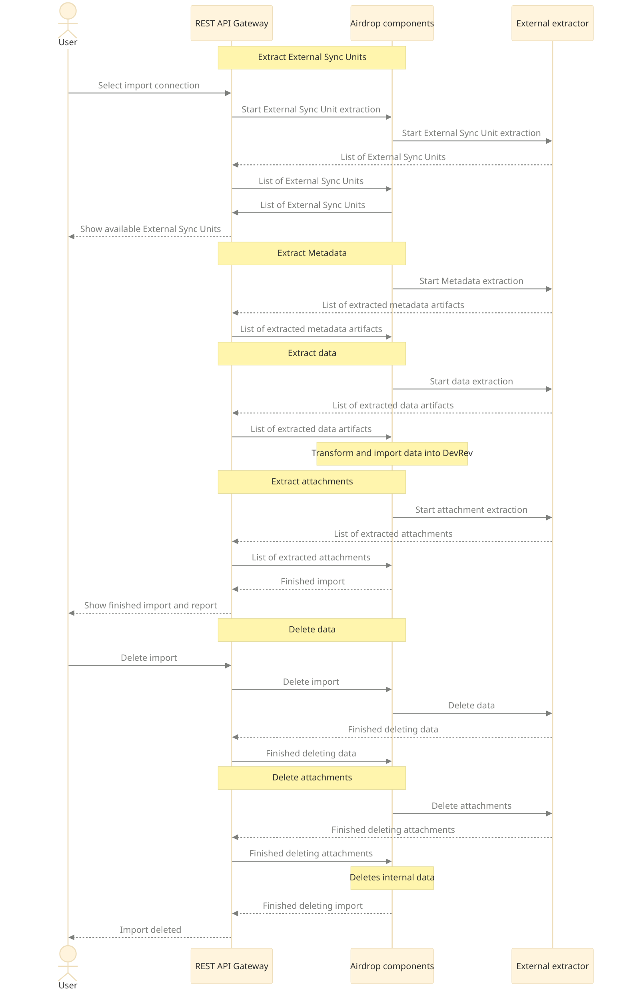

TODO: Explain how ADaaS code works by using the template

TODO: Explain the role of manifest.yaml and where is what

TODO: Explain how the communication between snap-in and DevRev works (through emitting events).

## Sync run phases

Each sync run is comprised out of phases.
Phases follow sequentially, and each can consist of one or more invocations of the snap-in.

1. External sync units extraction
2. Metadata extraction
3. Data extraction
4. Attachments extraction

