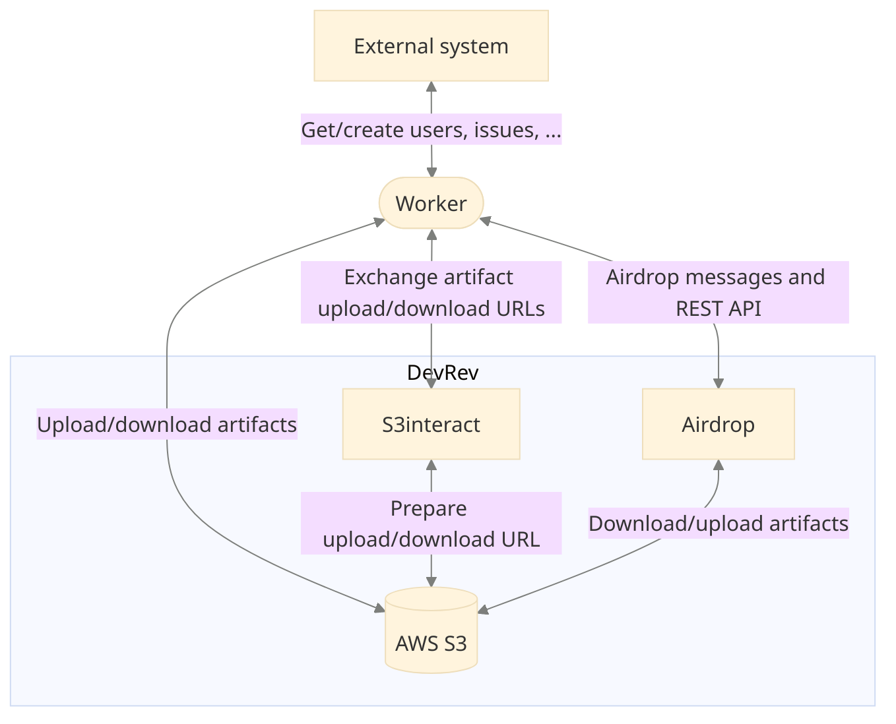
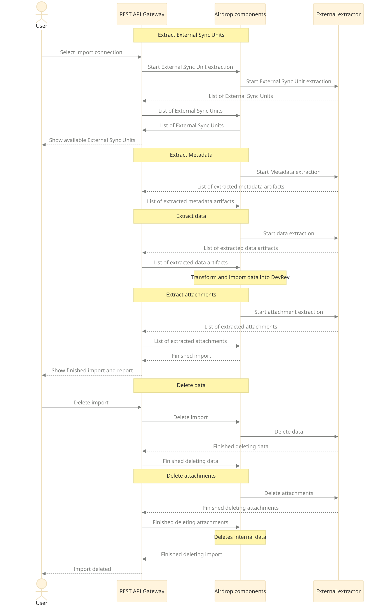

_Airdrop_ is DevRev’s solution to migrate data. It allows our customers to bring in their existing
data from external systems to DevRev, export data back to external systems, and keep data in sync
between DevRev and the external systems. It uses a standardized communication protocol for talking to Airdrop and a standardized data structure for all the files it extracts and processes, so that they can be seamlessly imported into DevRev.
You can read more about Airdrop in the [general documentation](https://docs.devrev.ai/import#airdrop-features).

DevRev is extending Airdrop's capabilities to give snap-in developers the ability to integrate with
DevRev’s Airdrop functionality.
It enables developers to create external workers (extractors and loaders) to bring data from various
external systems.

## Terminology

### Sync run

Airdrop extractions are done in _sync runs_.
A sync run is one execution of an import or sync.

### Forward sync

A _forward sync_ is a sync run from an external system to DevRev.
An extractor function in the snap-in is responsible for extracting data from the external system.

### Reverse sync

A _reverse sync_ is a sync run from DevRev to an external system.
It uses a loader function, to create or update data in the external system.

### 1-way (incremental) sync

A _1-way sync_ (or _incremental sync_) refers to any extraction after the initial import has been successfully completed.
An extractor extracts data that was created or updated in the external system after the start
of the latest successful forward sync, including any changes that occurred during the forward sync,
but were not picked up by it.

A snap-in must consult its state to get information on when the last successful forward sync started.
Airdrop snap-ins must maintain their own states that persists between phases in a sync run,
as well as between sync runs.

A 1-way sync extracts only the domain objects updated or created since the previous successful sync run.

## Sync run phases

Each sync run is comprised out of phases.
Phases follow sequentially, and each can consist of one or more invocations of the snap-in.

1. External sync units extraction
2. Metadata extraction
3. Data extraction
4. Attachments extraction

