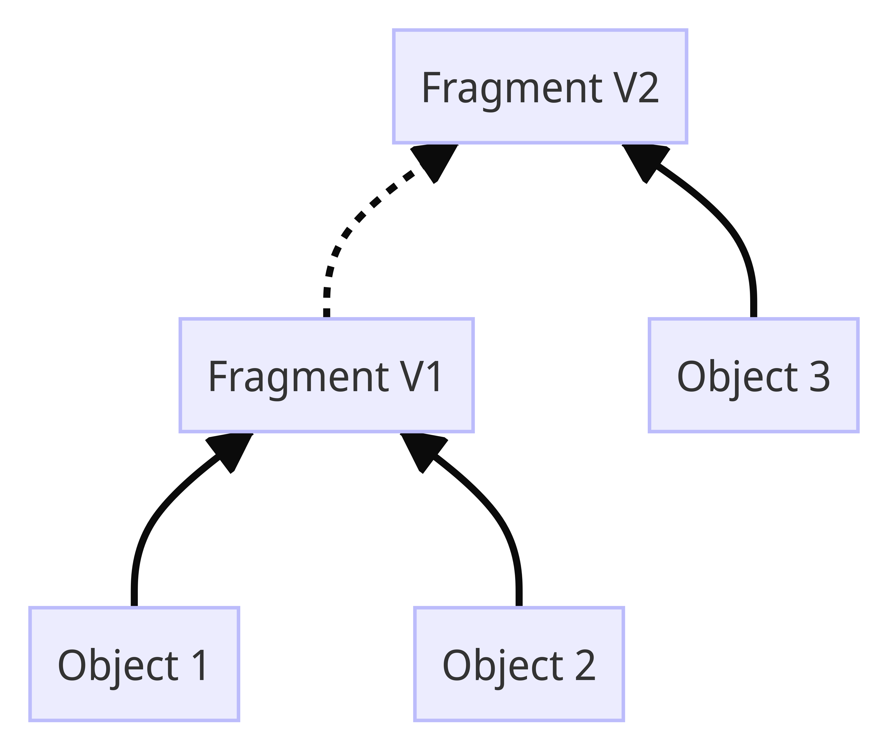

<Callout intent="warning">
This functionality is in Beta. It is not recommended for use in production applications.
</Callout>

DevRev allows you to customize its core objects, such as _issue_ and _ticket_, to fit
your organization's unique workflows and reporting needs. By using the customization
framework, you can extend these objects with custom fields that reflect your processes.

## Glossary

1. **Leaf type**: A core DevRev object like an _issue_ or _ticket_.
1. **Subtype**: A kind of a core object, like an _incident_ that is a subtype of an _issue_.
1. **Schema fragment**: A building block that defines custom fields for DevRev objects.

## Concepts

### Tenant custom field

Tenant custom fields allow extending the DevRev objects by adding new fields. These
custom fields are applied to all records of the specified object type within the
organization. For example, a release notes tenant custom field for _issue_ will be
applicable to all _issue_ records in the organization.

### Subtype

Subtypes are kinds of DevRev object types. They inherit all fields from the parent type
and can include additional, specific fields. For example, an _incident_ subtype of
_issue_ would have all _issue_ fields plus _incident_-specific fields.

### Schema fragment

DevRev objects are customized using _schema fragments_. A fragment is a building block
that defines a specific set of custom fields. When creating or updating an object
record, multiple schema fragments can be combined to determine the full set of custom
fields available for that record. The term _fragment_ is used because each schema
fragment contributes a portion of the overall object schema.

Multiple object records can reference the same schema fragment.

## Customizing a DevRev object
Let's say you want to track incidents across various environments in your organization.
This guide goes through the process of creating an _incident_ subtype for _issue_.

First, create a schema fragment defining the fields for the _incident_ subtype.
Make sure to replace `<TOKEN>` with your API token.

```curl
curl --location 'https://api.devrev.ai/schemas.custom.set' \
--header 'Content-Type: application/json' \
--header 'Accept: application/json' \
--header 'Authorization: <TOKEN>' \
--data '{
    "type": "custom_type_fragment",
    "description": "Attributes for tracking an incident",
    "leaf_type": "issue",
    "subtype": "incident",
    "subtype_display_name": "Incident",
    "fields": [
        {
            "name": "regression",
            "field_type": "bool",
            "ui": {
                "display_name": "Regression",
            }
        },
        {
            "name": "impacted_environments",
            "field_type": "array",
            "base_type": "enum",
            "allowed_values": [ "Dev", "QA", "Prod" ],
            "is_filterable": true,
            "ui": {
                "display_name": "Impacted Environments",
            }
        },
        {
            "name": "pia",
            "field_type": "rich_text",
            "ui": {
                "display_name": "PIA",
            }
        },
    ]
}'
```

Let's say there was an incident in the Prod environment. The developer working on the
mitigation can create an _incident_-flavored _issue_ object to track the incident.

```curl {14-16}
curl --location 'https://api.devrev.ai/works.create' \
--header 'Content-Type: application/json' \
--header 'Accept: application/json' \
--header 'Authorization: <TOKEN>' \
--data '{
    "type": "issue",
    "title": "API failure in Prod",

    ... // other required fields

    "custom_schema_spec": {
        "subtype": "incident"
    },
    "custom_fields": {
        "ctype__regression": true,
        "ctype__impacted_environments": [ "Prod" ]
    }
}'
```

After resolving the incident, the developer can update the issue object with release
notes. Adding release notes provides a clear record of what was deployed to resolve the
incident which can be valuable for future reference and communication with stakeholders.

To add release notes for the completed work, you can create a tenant custom field for
the _issue_ leaf type. **Since release notes are relevant to all issues, a tenant custom
field is used instead of a subtype-specific field.**

```curl {8-13}
curl --location 'https://api.devrev.ai/schemas.custom.set' \
--header 'Content-Type: application/json' \
--header 'Accept: application/json' \
--header 'Authorization: <TOKEN>' \
--data '{
    "type": "tenant_fragment",
    "description": "Tenant attributes for issues",
    "leaf_type": "issue",
    "fields": [
        {
            "name": "release_notes",
            "field_type": "rich_text",
            "ui": {
                "display_name": "Release Notes",
            }
        }
    ]
}'
```

Populate the release notes in the issue object created above:

```curl {8-13}
curl --location 'https://api.devrev.ai/works.update' \
--header 'Content-Type: application/json' \
--header 'Accept: application/json' \
--header 'Authorization: <TOKEN>' \
--data '{
    "id": "don:core:dvrv-us-1:devo/11FVC3ScK:issue/1",
    "type": "issue",
    "custom_schema_spec": {
        "tenant_fragment": true
    },
    "custom_fields": {
        "tnt__release_notes": "<RELEASE_NOTES>"
    }
}'
```

The final issue object now looks as follows:
```json {8-17}
{
    "id": "don:core:dvrv-us-1:devo/11FVC3ScK:issue/1",
    "type": "issue",
    "title": "API failure in Prod",
    "display_id": "ISS-1",
    "created_by": {...},
    "created_date": "2024-10-11T06:48:57.759Z",
    "modified_date": "2024-10-11T06:55:29.183Z",
    "custom_fields": {
        "ctype__regression": true,
        "ctype__impacted_environments": [ "Prod" ],
        "tnt__release_notes": "<RELEASE_NOTES>"
    },
    "subtype": "Incident",
    "custom_schema_fragments": [
        "don:core:dvrv-us-1:devo/11FVC3ScK:custom_type_fragment/2"
        "don:core:dvrv-us-1:devo/11FVC3ScK:tenant_fragment/1",
    ]
}
```

The following observations can be made from the above example:
* The custom fields defined by different fragments are held in different
namespaces in an object:
  - Subtype fields are of the form `ctype__<field_name>`.
  - Tenant fields are of the form `tnt__<field_name>`.
* References to each fragment are stored with the object.
* When updating an object, the `custom_schema_spec` can specify only the fragments being
modified. Here, only the tenant fragment is specified as we're updating just the release
notes field.

## Supported custom field types

The following custom field types are supported -

| Type      | Example                                  |
| --------- | ---------------------------------------- |
| int       | `42`                                     |
| double    | `3.14`                                   |
| bool      | `true`                                   |
| tokens    | `"apple"`                                |
| text      | `"Hello, world!"`                        |
| rich_text | `"**Hello**, world!"`                    |
| enum      | `"apple"`                                |
| timestamp | `"2020-10-20T00:00:00Z"` (RFC3339)       |
| date      | `"2020-10-20"` (YYYY-MM-DD)              |
| id        | `"don:core:dvrv-us-1:devo/test:issue/1"` |

The list variants of all the supported custom field types are also supported. For
example, `[]int`, `[]tokens`, etc.

## Schema fragment versioning

Schema fragments are immutable. When evolving a fragment:
1. A new fragment is created and chained to the older one.
2. The older fragment remains intact.
3. Objects referencing the older fragment are unaffected.

This approach preserves referential integrity during schema changes.

The same API endpoint `schemas.custom.set` is used to create and update fragments. The
API internally figures out how to version and chain the fragments.

Let's say you want to add a new boolean field _customer_impact_ to the _incident_ subtype
and delete the _regression_ field. The API call for this is shown below:

```curl {35-41}
curl --location 'https://api.devrev.ai/schemas.custom.set' \
--header 'Content-Type: application/json' \
--header 'Accept: application/json' \
--header 'Authorization: <TOKEN>' \
--data '{
    "type": "custom_type_fragment",
    "description": "Attributes for tracking an incident",
    "leaf_type": "issue",
    "subtype": "Incident",
    "fields": [
        {
            "name": "impacted_environments",
            "field_type": "array",
            "base_type": "enum",
            "allowed_values": [ "Dev", "QA", "Prod" ],
            "is_filterable": true,
            "ui": {
                "display_name": "Impacted Environments",
            }
        },
        {
            "name": "pia",
            "field_type": "rich_text",
            "ui": {
                "display_name": "PIA",
            }
        },
        {
            "name": "customer_impact",
            "field_type": "bool",
            "ui": {
                "display_name": "Customer Impact",
            }
        }
    ],
    "deleted_fields": [ "regression" ]
}'
```

Note that:
* The API payload reflects the entire state of the new fragment version.
* The `deleted_fields` array specifies the field names that are being deleted. If
not provided, the API call will fail due to the lack of an explicit field deletion
confirmation. This prevents accidental field deletions.

The above API call internally performs the following steps:
1. Creates a new fragment with the specified payload.
1. Updates the new fragment to point to the previous fragment. The `old_fragment_ref`
system field in the new fragment points to the previous fragment.
1. Updates the old fragment to point to the new fragment. The `new_fragment_ref` system
field in the old fragment points to the new fragment.

The diagram below shows the relationship between the fragments and how the versioning
scheme preserves the referential integrity.



### Object upgrades

A natural question arises at this point: what happens to the objects referencing the
old fragment version?

The object get and list APIs automatically upgrade the object **in-memory** to the
latest fragment version when queried. The necessary field adjustments are done in this
process. In the example above, when the object referencing the old fragment is read, the
_regression_ field is dropped in the response.

```curl {16-18, 21}
curl --location 'https://api.devrev.ai/works.get' \
--header 'Accept: application/json' \
--header 'Authorization: <TOKEN>' \
--data '{
    "id": "don:core:dvrv-us-1:devo/11FVC3ScK:issue/x"
}'

{
    "work": {
        "id": "don:core:dvrv-us-1:devo/11FVC3ScK:issue/x",
        "type": "issue",
        "title": "Critical Service Outage",
        "display_id": "ISS-x",
        "created_by": {...},
        "created_date": "2024-10-12T08:30:15.123Z",
        "custom_fields": {
            "ctype__impacted_environments": [ "Prod" ]
        },
        "subtype": "Incident",
        "custom_schema_fragments": [
            "don:core:dvrv-us-1:devo/11FVC3ScK:custom_type_fragment/2"
            "don:core:dvrv-us-1:devo/11FVC3ScK:tenant_fragment/1",
        ]
    }
}
```

The object now references the latest fragment version (custom_type_fragment/2). While
the optional release notes field is absent, the tenant fragment remains attached,
allowing for future tenant-specific field additions.

## Deprecating a custom schema fragment

Custom schema fragments can be deprecated to avoid creating work items using them. The
following POST request payload to `schemas.custom.set` can be used:

```json {9}
{
    "type": "custom_type_fragment",
    "description": "Attributes for tracking an incident",
    "leaf_type": "ticket",
    "subtype": "Incident",
    "fields": [
        ...
    ],
    "deprecated": true,
}
```

## Listing custom schema fragments

To verify the result of the above API invocation, you can [list the custom schema fragments](https://devrev.ai/docs/apis/beta-api-spec#/operations/custom-schema-fragments-list) in the org:

```curl
curl --location 'https://api.devrev.ai/schemas.custom.list' \
--header 'Accept: application/json' \
--header 'Authorization: <TOKEN>'
```

Deprecated fragments aren't listed in the response.
