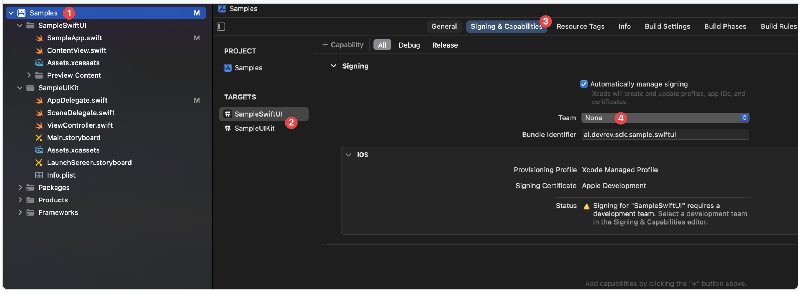

This section describes the process of integrating PLuG using the DevRev SDK with your iOS app.

## Requirements

- Xcode 16.0 or higher (latest stable version available on the App Store)
- Swift 5.9 or later
- Set the minimum deployment target for your iOS application as iOS 13

## Integration

The DevRev SDK can be integrated using either Swift Package Manager (SPM) or CocoaPods.

<Callout intent="note">
We recommend integrating the DevRev SDK using Swift Package Manager.
</Callout>

### Swift Package Manager (Recommended)

To integrate the DevRev SDK into your project using Swift Package Manager (SPM):

1. Open your project in Xcode and navigate to the **Add Package Dependency**.
2. Enter the DevRev SDK URL under **Enter Package URL**:
- For HTTPS: https://github.com/devrev/devrev-sdk-ios
- For SSH: git@github.com:devrev/devrev-sdk-ios.git **RECONFIRM THIS**
3. In the **Build Phases** section of your app target, locate the **Link Binary With Libraries** phase and confirm that `DevRevSDK` is linked. If not, add it by clicking **+** and selecting `DevRevSDK` from the list.

Now you should be able to import and use the DevRev SDK in your project.

### CocoaPods

To integrate the DevRev SDK using CocoaPods:

1. Add the following to your Podfile:

```ruby

pod 'DevRevSDK', '~> 1.0.0'

```
2. Run `pod install` in your project directory.

This will install the DevRev SDK in your project, making it ready for use.

## Set up the DevRev SDK

1. Open the DevRev web app at [https://app.devrev.ai](https://app.devrev.ai) and go to the **Settings** page.
2. Under **PLuG settings** obtain **Your unique App ID** (referred to as `supportID` in the code).
3. After obtaining the credentials, you can configure the DevRev SDK in your app. The SDK will be ready for use once you execute the following configuration method.
```swift
DevRev.configure(appID:)
```
For example:

```swift
DevRev.configure(appID: "abcdefg12345")
```

- UIKit apps

Configure the SDK in the `AppDelegate.application(_:didFinishLaunchingWithOptions:)` method.

- SwiftUI apps

Depending on your app's architecture, configure the SDK at the app's entry point or initial view.

## Identification

To utilize certain features of the DevRev SDK, user identification is required.

The identification function should be placed appropriately in your app after the user logs in. If you have the user information available at app launch, call the function after the `DevRev.configure(appID:)` method.

<Callout intent="note">
If you haven't previously identified the user, the DevRev SDK will automatically create an anonymous user for you immediately after the SDK is configured.
</Callout>

You can select from the following methods to identify users within your application:

### Anonymous identification

The anonymous identification method allows you to create an anonymous user with an optional user identifier, ensuring that no other data is stored or associated with the user.

```swift
DevRev.identifyAnonymousUser(userID:)
```

### Unverified identification

The unverified identification method identifies users with a unique identifier, but it does not verify their identity with the DevRev backend.

```swift
DevRev.identifyUnverifiedUser(_:)
```

The function accepts the `DevRev.Identity` structure, where the user identifier (`userId`) is the only required property; all other properties are optional.

### Update the user

You can update the user's information using the following method:

```swift

DevRev.updateUser(_:)

```

This function accepts the `DevRev.Identity` structure.

<Callout intent="note">
The identification functions are asynchronous. Ensure you wrap them in a `Task` when calling from synchronous contexts.
</Callout>

For example:

```swift
// Identify an anonymous user without a user identifier.
await DevRev.identifyAnonymousUser()

// Identify an unverified user using their email address as the user identifier.
await DevRev.identifyUnverifiedUser(Identity(userID: "foo@example.org"))

// Update the user's information.
await DevRev.updateUser(Identity(organizationID: "foo-bar-1337"))
```

## PLuG support chat

### UIKit

The support chat feature can be displayed either as a modal screen from a specific view controller or pushed onto a navigation stack. 

To show the support chat screen in your app, you can use the following overloaded method:

```swift
await DevRev.showSupport(from:isAnimated:)
```

- When a `UIViewController` is passed as the `from` parameter, the screen is shown modally.

- When a `UINavigationController` is passed as the `from` parameter, the screen is pushed onto the navigation stack.

If you want to display the support chat screen from the top-most view controller, use the following method:

```swift
await DevRev.showSupport(isAnimated:)
```

For example:

```swift
/// Push the support chat screen to a navigation stack.
await DevRev.showSupport(from: mainNavigationController)

/// Show the support chat screen modally from a specific view controller.
await DevRev.showSupport(from: settingsViewController)

/// Show the support chat screen from the top-most view controller, without an animation.
await DevRev.showSupport(isAnimated: false)
```
### SwiftUI

To display the support chat screen in a SwiftUI app, you can use the following view:

```swift
DevRev.supportView
```

#### New conversation closure

You can receive a callback when a new conversation is created by using the following:

```swift
DevRev.conversationCreatedCompletion
```

This allows your app to access the ID of the newly created conversation.

For example:

```swift
DevRev.conversationCreatedCompletion = { conversationID in
	print("A new conversation has been created: \(conversationID).")
}
```

 ## Analytics

The DevRev SDK allows you to send custom analytic events by using a name and a string dictionary. You can track these events using the following function:

```swift
DevRev.trackEvent(name:properties:)
```

For example:

```swift
await DevRev.trackEvent(name: "open-message-screen", properties: ["id": "foo-bar-1337"])
```

## Session analytics

The DevRev SDK offers session analytics features to help you understand how users interact with your app.

### Opt in or out

Session analytics features are opted-in by default, enabling them from the start. However, you can opt-out using the following method:

```swift
DevRev.stopAllMonitoring()
```

To opt back in, use the following method:

```swift
DevRev.resumeAllMonitoring()
```

## Session recording

You can enable session recording to capture user interactions with your app.

<Callout intent="note">
The session recording feature is opt-in and is enabled by default.
</Callout>

The session recording feature includes the following methods to control the recording:

| Method                                                               | Action                                                    |
|--------------------------------------------------------------------|-----------------------------------------------------------|
|`DevRev.startRecording()`   | Starts the session recording.                             |
|`DevRev.stopRecording()`    | Ends the session recording and uploads it to the portal. |
|`DevRev.pauseRecording()`   | Pauses the ongoing session recording.                     |
|`DevRev.resumeRecording()`  | Resumes a paused session recording.                       |

## Session properties

You can add custom properties to the session recording to help you understand the context of the session. The properties are defined as a dictionary of string values.

```swift
DevRev.addSessionProperties(_:)
```

To clear the session properties in scenarios such as user logout or when the session ends, use the following method: 

```swift
DevRev.clearSessionProperties()
```

## Masking sensitive data

To protect sensitive data, the DevRev SDK provides an auto-masking feature that masks data before sending to the server. Input views such as text fields, text views, and web views are automatically masked.

While the auto-masking feature may be sufficient for most situations, you can manually mark additional views as sensitive using the following method:

```swift
DevRev.markSensitiveViews(_:)
```

If any previously masked views need to be unmasked, you can use the following method:

```swift
DevRev.unmarkSensitiveViews(_:)
```

## Timers

The DevRev SDK offers a timer mechanism to measure the time spent on specific tasks, allowing you to track events such as response time, loading time, or any other duration-based metrics.

The mechanism utilizes balanced start and stop methods, both of which accept a timer name and an optional dictionary of properties.

To start a timer, use the following method:

```swift
DevRev.startTimer(_:properties:)
```

To balance it with a stop method, use the following:

```swift
DevRev.stopTimer(_:properties:)
```

For example:

```swift
DevRev.startTimer("response-time", properties: ["id": "foo-bar-1337"])

// Perform the task that you want to measure.

DevRev.stopTimer("response-time", properties: ["id": "foo-bar-1337"])
```

## Screen tracking

The DevRev SDK offers automatic screen tracking to help you understand how users navigate through your app. Although activities are automatically tracked, you can manually track screens using the following method:

```swift
DevRev.trackScreenName(_:)
```

For example:

```swift
DevRev.trackScreenName("profile-screen")
```

## Push notifications

You can configure your app to receive push notifications from the DevRev SDK. The SDK is designed to handle push notifications and execute actions based on the notification's content.

The DevRev backend sends push notifications to your app to alert users about new messages in the PLuG support chat.

### Configuration

To receive push notifications, you need to configure your DevRev organization by following the Push Notifications Integration guide (**TBD ITEM**).

You need to ensure that your iOS app is configured to receive push notifications. You can follow the [Apple documentation](https://developer.apple.com/documentation/usernotifications/registering_your_app_with_apns) for guidance on registering your app with Apple Push Notification Service (APNS).

### Register for push notifications

<Callout intent="note">
Push notifications require SDK configuration and user identification, whether unverified or anonymous, to ensure delivery to the correct user.
</Callout>

The DevRev SDK offers a method to register your device for receiving push notifications. You can register for push notifications using the following method:

```swift
DevRev.registerDeviceToken(_:deviceID:)
```

The method requires a device identifier, which can either be an identifier unique to your system or the Apple-provided Vendor Identifier (IDFV). Typically, registration is called from the `AppDelegate.application(_:didRegisterForRemoteNotificationsWithDeviceToken:)` method.

For example:

```swift
func application(
	_ application: UIApplication,
	didRegisterForRemoteNotificationsWithDeviceToken deviceToken: Data
) {
	guard
		let deviceID = UIDevice.current.identifierForVendor?.uuidString
	else {
		return
	}

	Task {
		await DevRev.registerDeviceToken(
			deviceToken,
			deviceID: deviceID
		)
	}
}
```

### Unregister from push notifications

If your app no longer needs to receive push notifications, you can unregister the device.

Use the following method to unregister the device:

```swift
DevRev.unregisterDevice(_:)
```

This method requires the device identifier, which should be the same as the one used during registration. It is recommended to place this method after calling `UIApplication.unregisterForRemoteNotifications()` in your app.

For example:

```swift
UIApplication.shared.unregisterForRemoteNotifications()

Task {
	guard
		let deviceID = UIDevice.current.identifierForVendor?.uuidString
	else {
		return
	}

	await DevRev.unregisterDevice(deviceID)
}
```

### Handle push notifications

To properly handle push notifications, implement the following method, typically in either the `UNUserNotificationCenterDelegate.userNotificationCenter(_:didReceive:)` or `UIApplicationDelegate.application(_:didReceiveRemoteNotification:fetchCompletionHandler:)`:

```swift
DevRev.processPushNotification(_:)
```

For example:

```swift
func userNotificationCenter(
	_ center: UNUserNotificationCenter,
	didReceive response: UNNotificationResponse
) async {
	await DevRev.processPushNotification(response.notification.request.content.userInfo)
}
```

## Sample app

This repository includes a sample app demonstrating use cases for both UIKit and SwiftUI.

Before using the sample app, configure it with your Apple Developer team and DevRev credentials. For convenience, the code is marked with compiler error directives (`#error`) in areas that require your attention.

1. Add your credentials:
- For SwiftUI, add your credentials to `ContentView.swift`.
- For UIKit, add your credentials to `AppDelegate.swift`.
2. Once you've added your credentials, delete or comment out the compiler error lines in the respective files.
3. Configure code signing for the sample target:

	a. Open the project settings.

	b. Select the appropriate target.

	c. Go to the **Signing & Capabilities** section.

	d. Under **Team**, select your development team.


## Troubleshooting

- **Issue**: Can't import the SDK into my app.   
	**Solution**: Double-check the setup process and ensure that `DevRevSDK` is correctly linked to your application.

- **Issue**: How does the DevRev SDK handle errors?   
	**Solution**: The DevRev SDK reports all errors in the console using Apple's Unified Logging System. Look for error messages in the subsystem `ai.devrev.sdk`.

- **Issue**: Support chat won't show.   
	**Solution**: Ensure you have correctly called one of the identification methods: `DevRev.identifyUnverifiedUser(...)` or `DevRev.identifyAnonymousUser(...)`.

- **Issue**: Not receiving push notifications.   
	**Solution**: Ensure that your app is configured to receive push notifications and that your device is registered with the DevRev SDK.
