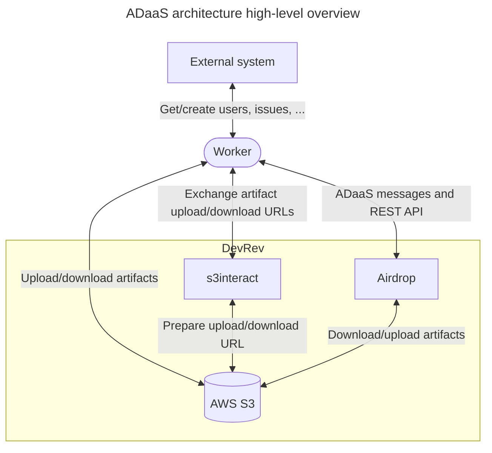

# Airdrop-as-a-Service (ADaaS)

Airdrop-as-a-Service (ADaaS) as a system consists of the internal Airdrop components and a Worker (Extractor or Loader),
which is a Snap-In with a predefined structure.
These Workers (Extractors and Loaders) can be built by anyone, not just DevRevelers.

It is useful to know how the system works though, so this section explains how ADaaS works at a high level.
Message protocols and other specifics can be found in the Extractor and Loader sections.

It’s also useful to know that Airdrop uses its own AWS S3 structure
(and its own buckets) and that only Airdrop components have access to it.
This means that Workers can’t access these buckets directly,
which is why all their data has to be uploaded to DevRev through S3Interact.

For clarity, Artifact API and Airdrop are shown as separate entities,
even though they are both accessed through DevRev’s API.
Worker is shown as external, to clarify that it is developed by third parties,
even though it runs on DevRev’s infrastructure.

