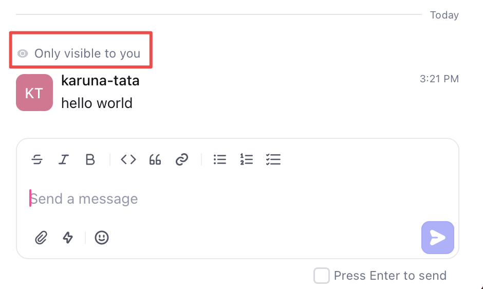

## Introduction

In this tutorial, you'll learn how to send restricted visibility messages on the timeline of an object by using the `timeline-entries-create` API. These messages are only visible to the specific users you give access to.

The [timeline entries](/api-reference/timeline-entries/create) API creates discussions (comments) on the timeline of an object such as a ticket or issue. These messages can be sent by users or by a bot to communicate information about a customer, such as their last login time, most recent page visit, or encountered errors.

### Send a restricted visibility message

The following payload structure creates a restricted visibility message:

<CodeBlock>
```json Request payload
{
    "object": "don:core:<partition>:devo/<dev-org-id>:<object-type>/<object-id>",
    "body": "<private message to post on timeline>",
    "visibility": "private",
    "private_to": [<list of user IDs>],
    "type": "timeline_comment"
}
```
</CodeBlock>

Required fields:
* `object` - string containing `<partition>`, `<dev-org-id>`, and `<object-id>`
* `body` - string containing the message to post
* `visibility` - access level for the message:
    - `private` - visible only to specified users
    - `internal` - visible within the workspace
    - `external` - visible to workspace and customers
    - `public` - visible to all
* `type` - must be set to `timeline_comment`

1. Obtain the [object ID](/api-reference/getting-started) and object type for the target message location (for example, in issue `ISS-69`, `69` is the object ID and `ISS` indicates the object type `issue`).

2. Get the `dev-org-id` and `partition` by calling the [`dev-users.self` API](/api-reference/getting-started#send-your-first-api-request).

3. Collect the display IDs of users who should receive the private message and add them to the `private_to` array (for example, `DEVU-1`).

4. Send a POST request to "https://api.devrev.ai/timeline-entries.create" with your PAT in the authorization header and the completed payload.

<CodeBlock>
```bash Request
curl -X POST -H "Content-Type: application/json" -d 
'{
    "object": "don:core:<partition>:devo/<dev-org-id>:<object-type>/<object-id>",
    "body": "message",
    "visibility": "private",
    "type": "timeline_comment"
}' 
'https://api.devrev.ai/timeline-entries.create' \
--header 'Authorization: <PAT>'
```
</CodeBlock>

The API returns a JSON response:

```json Response
{
    "timeline_entry": {
        "type": "timeline_comment",
        "body": "message",
        "body_type": "text",
        "created_by": {
            "type": "dev_user",
            "display_id": "DEVU-1",
            "display_name": "John Doe",
            "email": "karuna.tata@devrev.ai",
            "full_name": "John Doe",
            "id": "don:identity:dvrv-us-1:devo/<dev-org-id>:devu/1",
            "state": "active"
        },
        "created_date": "2023-11-29T09:05:47.497205Z",
        "id": "don:core:dvrv-us-1:devo/<dev-org-id>:conversation/172:comment/xqsvvdwvt6hjw",
        "object": "don:core:dvrv-us-1:devo/<dev-org-id>:conversation/172",
        "object_type": "conversation",
        "visibility": "private"
    }
}
```

The message appears on the object's timeline in the UI, visible only to the creator and users specified in `private_to`.


## Summary

This tutorial demonstrated how to post comments on an issue or ticket timeline using the `timeline-entries.create` API with different visibility levels. Use this functionality to create timeline comments through automation or manual processes based on your requirements.